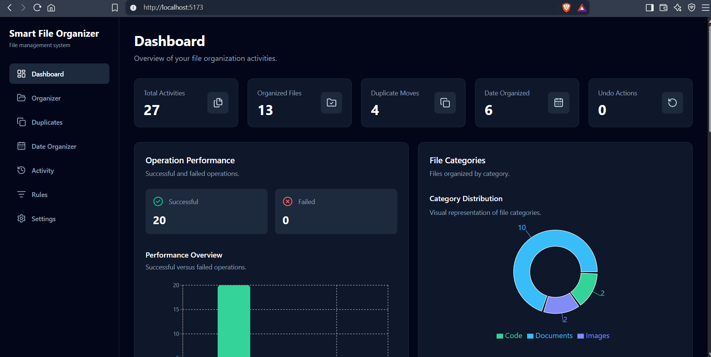
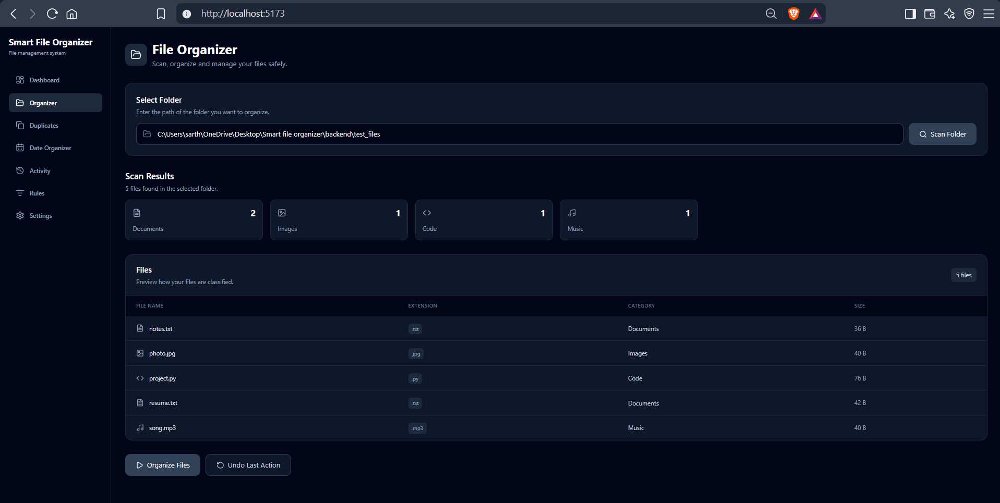
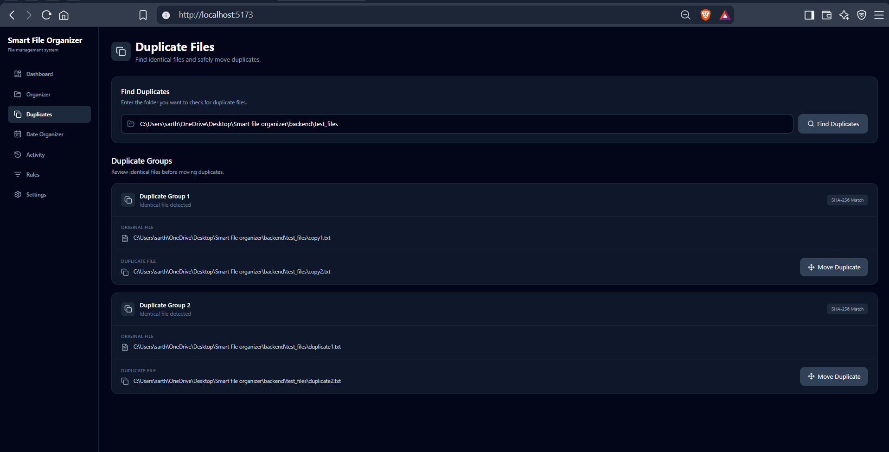
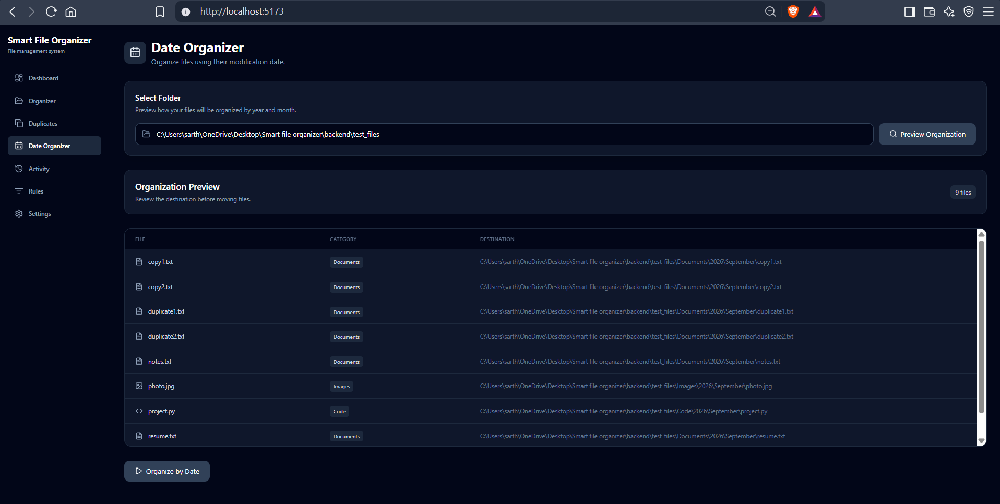
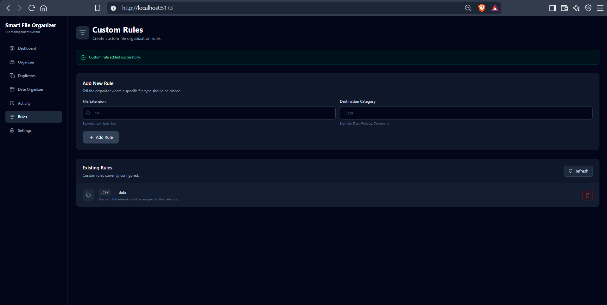
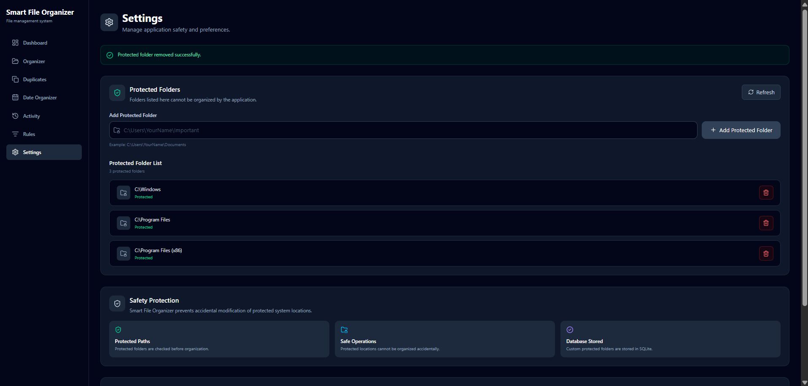

Smart File Organizer

A full-stack file organization and management application that automatically scans folders, classifies files, detects duplicates, and organizes files safely.

📌 Project Overview

Smart File Organizer is a full-stack application designed to make file management easier and safer.

Instead of manually sorting files into different folders, the application scans a selected folder, identifies files based on their extensions, and organizes them into appropriate categories.

The project also provides duplicate detection, date-based organization, custom rules, undo functionality, activity history, protected folders, and a statistics dashboard.

✨ Features

📁 Recursive folder scanning

🗂️ Automatic file classification

📦 Category-based file organization

👀 File organization preview

🔍 Duplicate detection using SHA-256

🛡️ Safe duplicate handling

📅 Date-based organization

⚙️ Custom file-extension rules

↩️ Undo last organization action

📋 Activity history

🔐 Protected folder safety

📊 Statistics dashboard

📈 Data visualization with charts

🎨 Professional responsive UI

🔗 React frontend with FastAPI backend

💾 SQLite database for application history

🛠️ Tech Stack

Frontend

React.js

Tailwind CSS

Axios

Recharts

Lucide React

Vite

Backend

Python

FastAPI

SQLAlchemy

Pydantic

SQLite

Uvicorn

Python Modules

pathlib

shutil

hashlib

logging

datetime

collections

🏗️ System Architecture

Smart File Organizer
        │
        ▼
React Frontend
        │
      Axios
        │
        ▼
FastAPI REST API
        │
        ▼
Python Services
   ┌────┼────┐
   │    │    │
   ▼    ▼    ▼
File  SQLite Logging
System Database

🔄 Application Workflow

Select Folder
     ↓
Scan Folder
     ↓
Read File Metadata
     ↓
Classify Files
     ↓
Preview Changes
     ↓
Organize Files
     ↓
Save Activity
     ↓
Generate Statistics

📂 Project Structure

smart-file-organizer/
│
├── backend/
│   ├── app/
│   │   ├── api/
│   │   │   └── organizer.py
│   │   ├── core/
│   │   │   └── logger.py
│   │   ├── database/
│   │   │   └── database.py
│   │   ├── models/
│   │   │   ├── activity.py
│   │   │   └── protected_folder.py
│   │   ├── schemas/
│   │   │   └── organizer.py
│   │   └── services/
│   │       ├── classifier.py
│   │       ├── conflict_handler.py
│   │       ├── date_organizer.py
│   │       ├── duplicate_detector.py
│   │       ├── duplicate_manager.py
│   │       ├── organizer.py
│   │       ├── rules.py
│   │       ├── safety.py
│   │       ├── scanner.py
│   │       ├── statistics.py
│   │       └── undo_manager.py
│   ├── logs/
│   ├── tests/
│   └── requirements.txt
│
├── concept/
│   └── Module concept notes
│
├── frontend/
│   ├── public/
│   ├── src/
│   │   ├── components/
│   │   │   ├── activity/
│   │   │   ├── dashboard/
│   │   │   ├── dateOrganizer/
│   │   │   ├── duplicates/
│   │   │   ├── layouts/
│   │   │   ├── organizer/
│   │   │   ├── rules/
│   │   │   └── settings/
│   │   ├── services/
│   │   │   └── api.js
│   │   ├── App.jsx
│   │   ├── App.css
│   │   ├── index.css
│   │   └── main.jsx
│   ├── package.json
│   └── vite.config.js
│
├── .gitignore
└── README.md

🗂️ File Classification

The application classifies files according to their extensions.

Extension

Category

.pdf, .doc, .docx, .txt

Documents

.jpg, .jpeg, .png, .gif

Images

.mp4, .mkv, .avi, .mov

Videos

.mp3, .wav, .flac, .m4a

Music

.py, .js, .jsx, .java, .cpp

Code

.zip, .rar, .7z, .tar

Archives

.exe, .msi, .bat, .cmd

Executables

Unknown extensions

Others

📁 File Organization Example

Before

Downloads/
├── resume.pdf
├── photo.jpg
├── song.mp3
├── project.py
└── backup.zip

After

Downloads/
├── Documents/
│   └── resume.pdf
├── Images/
│   └── photo.jpg
├── Music/
│   └── song.mp3
├── Code/
│   └── project.py
└── Archives/
    └── backup.zip

🔍 Duplicate Detection

Duplicate files are detected using the SHA-256 hashing algorithm.

File 1
  ↓
SHA-256 Hash
  ↓
Hash A

File 2
  ↓
SHA-256 Hash
  ↓
Hash A

Same Hash
  ↓
Possible Duplicate

Duplicate files can be moved safely into a Duplicates folder.

📅 Date-Based Organization

Files can also be organized according to their modification date.

Example:

Documents/
└── 2026/
    └── September/
        └── resume.pdf

⚙️ Custom Rules

Users can create custom extension rules.

Example:

.csv → Data

Custom rules allow users to override the default classification system.

↩️ Undo System

The application records file movement information so that the latest organization action can be reversed.

Example:

Documents/resume.pdf
        ↓
      Undo
        ↓
Original Location

📋 Activity History

Important operations are recorded in the SQLite database.

Examples include:

File organization

Duplicate movement

Date-based organization

Undo operations

This allows the application to maintain an operation history.

🔐 Protected Folders

The application includes a safety mechanism to prevent accidental organization of important system folders.

Default protected folders include:

C:\Windows
C:\Program Files
C:\Program Files (x86)

Users can also add custom protected folders.

📊 Dashboard

The dashboard provides an overview of application activity.

It displays information such as:

Total activities

Organized files

Duplicate moves

Date-organized files

Undo operations

Successful operations

Failed operations

Category distribution

Operation statistics

Charts are used to make the statistics easier to understand.

🔌 API

The backend is built using FastAPI and exposes REST API endpoints for the frontend.

Main operations include:

POST   /organizer/scan
POST   /organizer/organize
POST   /organizer/duplicates
POST   /organizer/duplicate-preview
POST   /organizer/move-duplicate
GET    /organizer/activity
POST   /organizer/date-preview
POST   /organizer/organize-by-date
POST   /organizer/rules
GET    /organizer/rules
DELETE /organizer/rules
POST   /organizer/undo
GET    /organizer/protected-folders
POST   /organizer/protected-folders
DELETE /organizer/protected-folders
GET    /organizer/statistics
GET    /organizer/dashboard

💾 Database

The project uses SQLite with SQLAlchemy.

The database stores application information such as:

Activity history

Protected folders

Operation status

Categories

The database file is intentionally excluded from Git using .gitignore.

🚀 Installation & Setup

1. Clone the Repository

git clone https://github.com/sarthiv/smart-file-organizer.git
cd smart-file-organizer

🐍 Backend Setup

Move into the backend directory:

cd backend

Create a virtual environment:

python -m venv venv

Activate the virtual environment:

.\venv\Scripts\Activate.ps1

Install dependencies:

pip install -r requirements.txt

Start the FastAPI server:

uvicorn app.main:app --reload

Backend:

http://127.0.0.1:8000

FastAPI Swagger documentation:

http://127.0.0.1:8000/docs

⚛️ Frontend Setup

Open a new terminal and move to the frontend directory:

cd frontend

Install dependencies:

npm install

Start the development server:

npm run dev

Frontend will normally run at:

http://localhost:5173

🧪 Testing

The project was tested for the following major operations:

Backend health check

Folder scanning

File classification

File organization

Duplicate detection

Duplicate movement

Date-based organization

Custom rules

Undo functionality

Protected folders

Dashboard statistics

Activity history

Responsive UI

End-to-end workflow

🛡️ Safety Considerations

The application is designed with several safety mechanisms:

Preview before organization

Protected folders

Duplicate detection

Filename conflict handling

Undo functionality

Error handling

Activity logging

These features help reduce the risk of accidental file operations.

📚 Learning Resources

The concept/ directory contains notes explaining the concepts used during development.

These notes cover topics such as:

FastAPI

File scanning

File classification

React and FastAPI integration

Duplicate detection

Safe duplicate handling

Activity logging

Date-based organization

Custom rules

Undo systems

They can also be used for:

College viva preparation

Technical interviews

Revision

Understanding the project architecture

🔮 Future Improvements

Possible future improvements include:

AI-based file classification

Advanced file search

File preview

Cloud storage integration

Scheduled automatic organization

Advanced rule management

File recovery system

User authentication

Multi-user support

Cloud deployment

More advanced analytics

👨‍💻 Author

Sarthi Verma

B.Tech CSE Student

📄 License

This project is currently developed for educational, learning, and portfolio purposes.

## 📸 Screenshots

### Dashboard

### File Organizer

### Duplicate Detection

### Date-Based Organization

### Custom Rules

### Protected Folders
